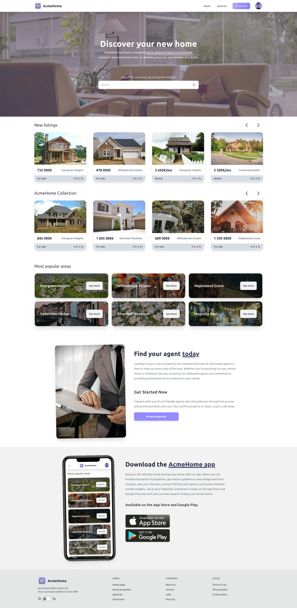
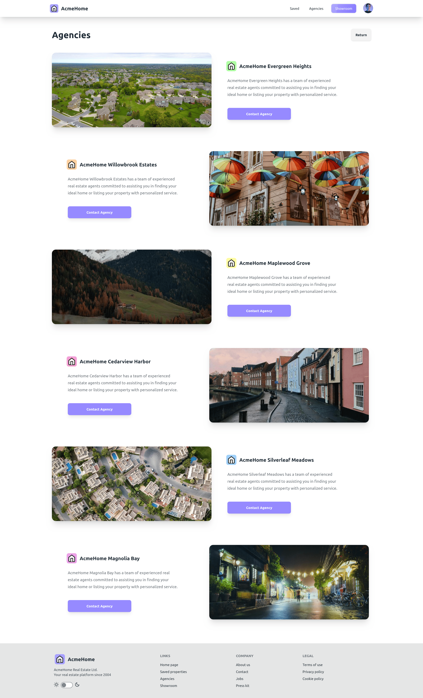
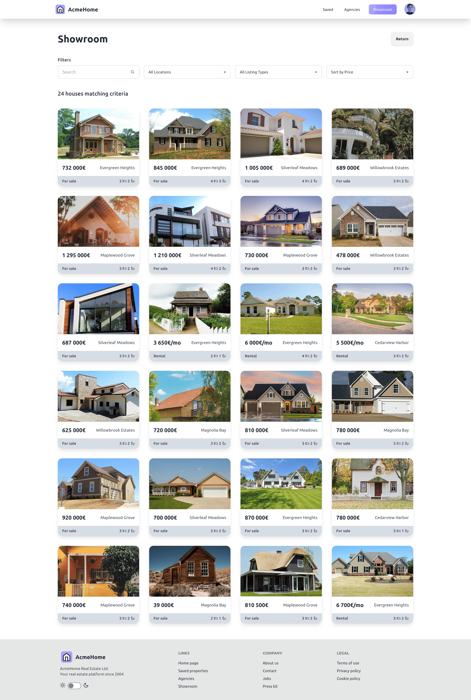
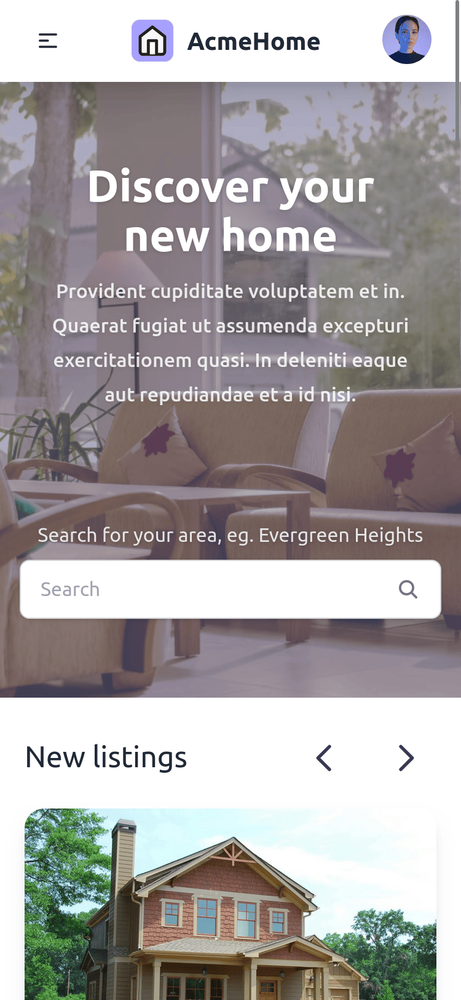
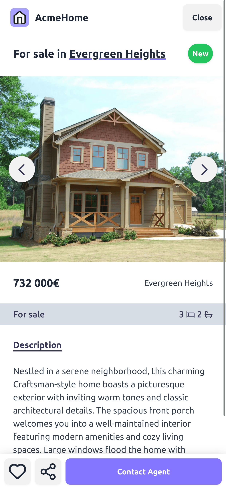
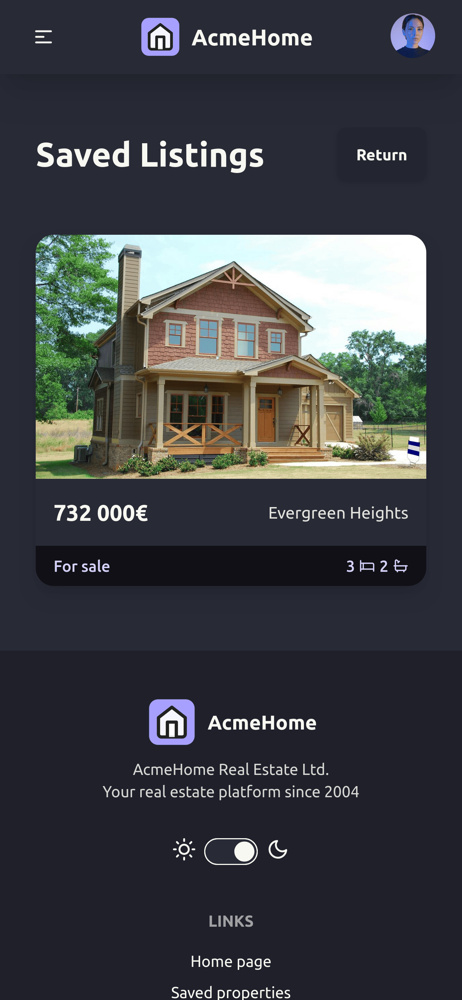
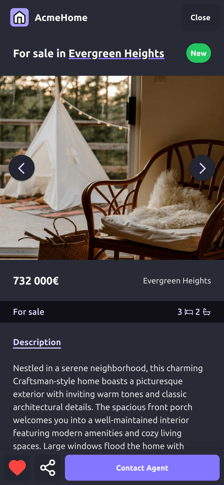
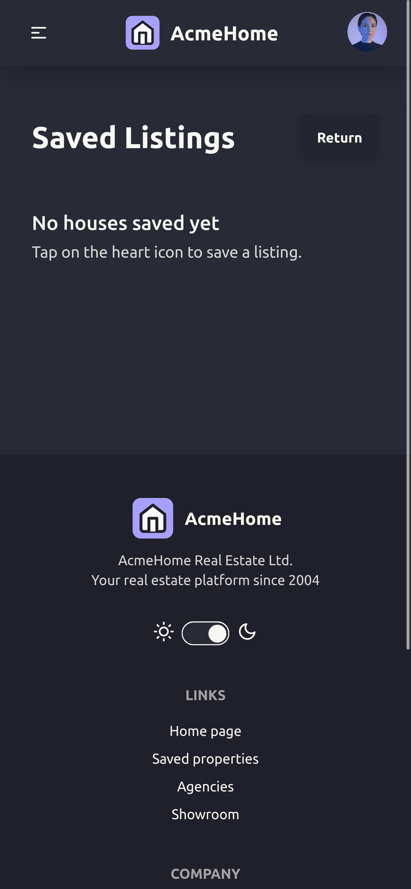
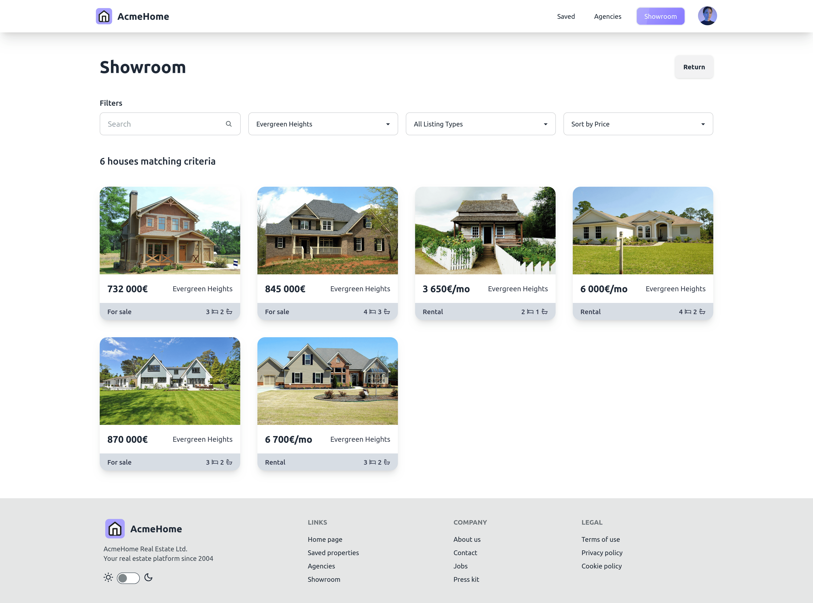
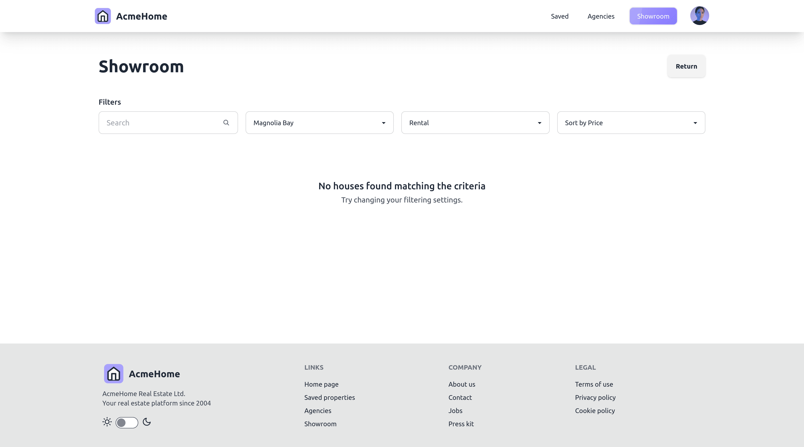

# AcmeHome - Mockup Real Estate Website 

This is a mockup of a real estate website built from scratch by me using React, Tailwind CSS, and daisyUI, including the design. The website offers various features:

The Home page features two carousels with "New listings" and "AcmeHome Collection" listings, a "Most popular areas" section, a "Find your agent" section, and a mockup mobile app section. It has an agencies page where you can browse all agencies in all areas. On the showroom page, you can browse all houses and filter them as you like. Users can browse properties, save them, search by area and price, sort them, and much more.

## Screenshots

